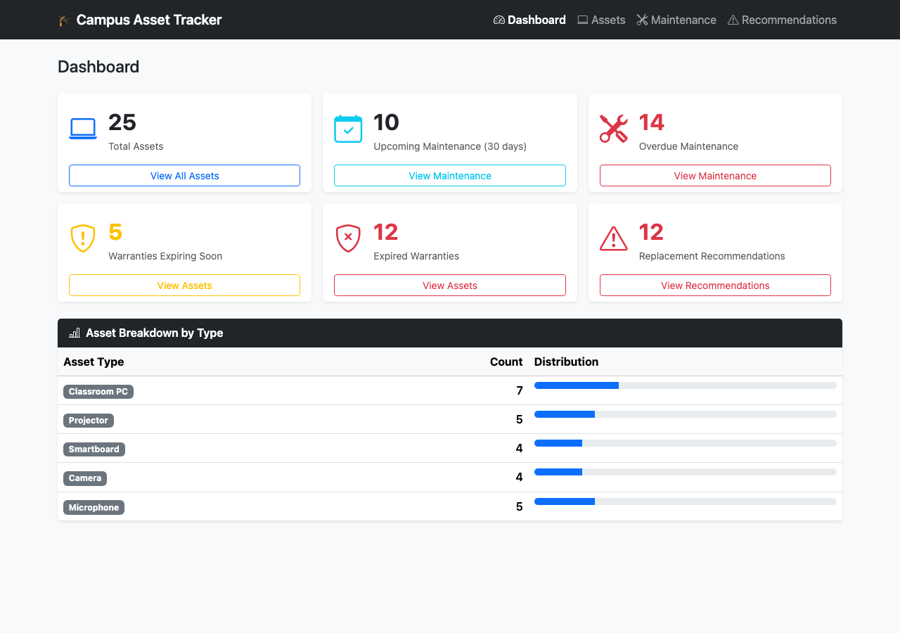
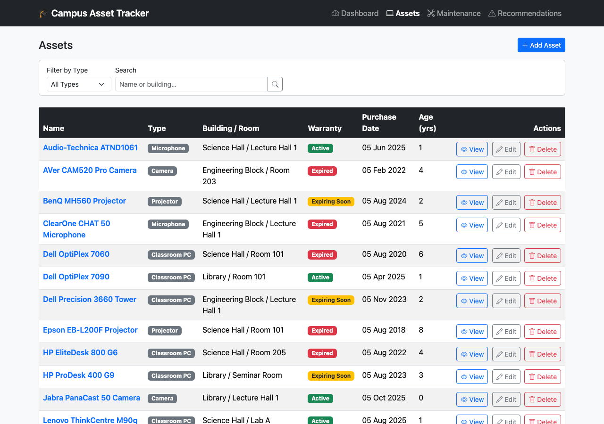
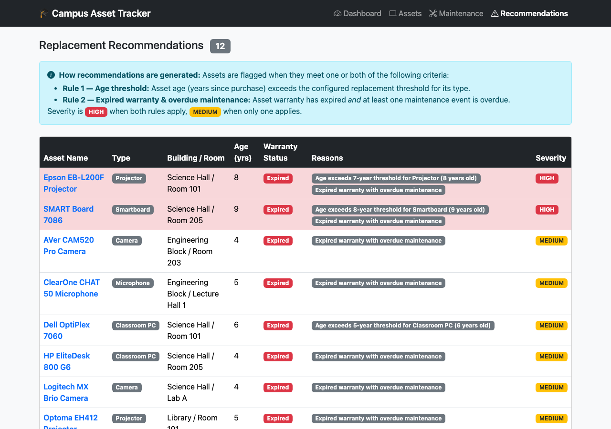

# 🎓 Campus Academic Technology Registry

[](https://github.com/Alyssa-Mercado/campus-academic-tech-registry/actions/workflows/ci.yml)

A Spring Boot web application for managing classroom technology assets across university buildings.

## Screenshots

### Dashboard


### Asset List


### Replacement Recommendations


## Features

- **Asset Management** — Track Classroom PCs, Projectors, Smartboards, Cameras, and Microphones across buildings and rooms
- **Maintenance Tracking** — Log scheduled and completed maintenance events; automatically flags overdue items
- **Replacement Recommendations** — Rule-based engine flags assets that exceed their age threshold or have expired warranties with overdue maintenance
- **Warranty Tracking** — Assets are automatically classified as Active, Expiring Soon (within 90 days), or Expired
- **Dashboard** — At-a-glance summary of asset health, maintenance status, and replacement recommendations

## Tech Stack

| Layer | Technology |
|---|---|
| Language | Java 21 |
| Framework | Spring Boot 3.2.5 |
| Templating | Thymeleaf 3.1 |
| Persistence | Spring Data JPA + Hibernate 6 |
| Database | H2 (in-memory) |
| UI | Bootstrap 5.3 + Bootstrap Icons 1.11 |
| Build | Maven 3 |

## Running Locally

**Prerequisites:** Java 21+, Maven 3

```bash
mvn spring-boot:run
```

Then open [http://localhost:8080](http://localhost:8080) in your browser.

> The database is in-memory — it resets on every restart and is automatically seeded with 25 sample assets and 35 maintenance events.

## Using PostgreSQL (Dev Profile)

To run against a real PostgreSQL database instead of H2:

1. Create a database: `CREATE DATABASE assetdb;`
2. Set environment variables (or edit [`application-dev.properties`](src/main/resources/application-dev.properties) directly):
   ```bash
   export DB_USERNAME=postgres
   export DB_PASSWORD=yourpassword
   ```
3. Run with the dev profile:
   ```bash
   mvn spring-boot:run -Dspring-boot.run.profiles=dev
   ```

## Testing Endpoints

An [`requests.http`](requests.http) file is included, compatible with:
- **IntelliJ IDEA** — built-in HTTP Client
- **VS Code** — [REST Client extension](https://marketplace.visualstudio.com/items?itemName=humao.rest-client)

## Project Structure

```
src/main/java/com/university/assettracker/
├── config/         # DataSeeder, ReplacementRuleConfig, GlobalModelAdvice
├── controller/     # MVC controllers for each section
├── domain/         # JPA entities and enums
├── repository/     # Spring Data JPA repositories
└── service/        # Business logic
src/main/resources/
├── templates/      # Thymeleaf HTML templates
├── static/         # Bootstrap CSS/JS (bundled locally)
├── application.properties          # Default profile (H2)
└── application-dev.properties      # Dev profile (PostgreSQL)
```

## Replacement Rules

Assets are flagged for replacement when:
- **Rule 1 — Age:** Asset age exceeds the configured threshold for its type (PC: 5yr, Projector: 7yr, Smartboard: 8yr, Camera: 6yr, Microphone: 6yr)
- **Rule 2 — Warranty + Maintenance:** Warranty has expired **and** at least one maintenance event is overdue

Severity is **HIGH** when both rules apply, **MEDIUM** when only one applies.
