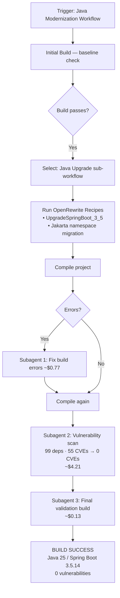

# Bob Java Modernization Workflow — How It Worked

> **Project:** Campus Academic Technology Registry  
> **Starting state:** Java 21 / Spring Boot 3.2.5  
> **End state:** Java 25 / Spring Boot 3.5.14 (Temurin distribution)  
> **Workflow used:** IBM Bob — Java Modernization → Java Upgrade path  
> **Total cost:** ~$5.11 across 3 subagents

---

## What the Workflow Is

Bob's **Java Modernization** workflow is a structured, multi-step automated process. When triggered, it:

1. Performs an **initial build** to establish a clean baseline
2. Prompts you to choose a **sub-workflow** (Java Upgrade, Liberty Replatforming, or UI Modernization)
3. Applies **OpenRewrite recipes** for safe, automated code transformations
4. Spawns a **subagent** to detect and fix any build errors the recipes introduced
5. **Scans all resolved dependencies** for known vulnerabilities via the OSV database and remediates them
6. Runs a **final validation build** confirming zero errors and zero warnings

The entire process runs through Bob's agent — no manual recipe configuration, no Maven plugin changes, no manual diff review required.

---

## Step-by-Step: What Happened

### 1 — Initial Build (Baseline)

Bob compiled the project at its starting state (Java 21 / Spring Boot 3.2.5) and confirmed a clean build with no errors or warnings before touching anything.

---

### 2 — Java Upgrade Sub-Workflow Selected

Bob selected the **Java Upgrade** path. This path covers:

- Bumping `java.version` and the Spring Boot parent POM version
- Migrating `javax.*` namespaces to `jakarta.*` (Jakarta EE 10, required since Spring Boot 3.0)
- Updating transitive dependencies to compatible versions
- Resolving any compilation errors the version bump introduces

---

### 3 — OpenRewrite Recipes Applied

Bob ran two OpenRewrite recipes against the codebase:

| Recipe | What it automated |
|---|---|
| `UpgradeSpringBoot_3_5` | Bumped `spring-boot-starter-parent` `3.2.5` → `3.5.14`; set `java.version` `21` → `25` |
| Jakarta namespace migration | Replaced all `javax.persistence.*` imports with `jakarta.persistence.*` across every entity and configuration class |

**Files changed by OpenRewrite:**

| File | Change |
|---|---|
| [`pom.xml`](../pom.xml) | Parent `3.2.5` → `3.5.14`; `java.version` `21` → `25`; vulnerability override properties added |
| [`Asset.java`](../src/main/java/com/university/assettracker/domain/Asset.java) | `javax.persistence.*` → `jakarta.persistence.*` |
| [`MaintenanceEvent.java`](../src/main/java/com/university/assettracker/domain/MaintenanceEvent.java) | `javax.persistence.*` → `jakarta.persistence.*` |

---

### 4 — Build Error Detection and Fix (Subagent 1, ~$0.77)

After the recipes ran, Bob compiled the project and detected **1 error in 1 file**. Bob spawned a focused subagent to diagnose and resolve the issue. The build returned to a passing state before continuing.

---

### 5 — Vulnerability Scan and Remediation (Subagent 2, ~$4.21)

Bob scanned all **99 resolved dependencies** against the [OSV vulnerability database](https://osv.dev) and found **55 vulnerabilities**. A second subagent resolved them by injecting **BOM property overrides** into [`pom.xml`](../pom.xml) — the standard Spring Boot pattern that keeps the BOM in control while pinning security-critical libraries to patched versions:

```xml
<!-- pom.xml — explicit vulnerability overrides -->
<logback.version>1.5.34</logback.version>
<jackson-bom.version>2.18.8</jackson-bom.version>
<tomcat.version>10.1.55</tomcat.version>
<spring-framework.version>6.2.19</spring-framework.version>
<spring-data-bom.version>2025.0.12</spring-data-bom.version>
<thymeleaf.version>3.1.5.RELEASE</thymeleaf.version>
<postgresql.version>42.7.12</postgresql.version>
<assertj.version>3.27.7</assertj.version>
```

---

### 6 — Final Validation (Subagent 3, ~$0.13)

Bob ran a final build and reported: `BUILD SUCCESS` — zero errors, zero warnings, Java 25 / Spring Boot 3.5.14 active, all 55 vulnerabilities resolved.

---

## Before and After

| Component | Before | After |
|---|---|---|
| Java version | 21 | **25** |
| Spring Boot | 3.2.5 | **3.5.14** |
| Spring Framework | 6.1.x (transitive) | **6.2.19** |
| JPA namespace | `javax.persistence.*` | **`jakarta.persistence.*`** (Jakarta EE 10) |
| Logback | BOM default | **1.5.34** (CVE-patched) |
| Jackson | BOM default | **2.18.8** (CVE-patched) |
| Tomcat | BOM default | **10.1.55** (CVE-patched) |
| Spring Data | BOM default | **2025.0.12** (CVE-patched) |
| Spring Framework | BOM default | **6.2.19** (CVE-patched) |
| PostgreSQL driver | BOM default | **42.7.12** (CVE-patched) |
| CI Java version | 21 | **25 (Temurin)** |
| Known vulnerabilities | 55 | **0** |

---

## What the Workflow Did NOT Change

The workflow scoped its changes to the **platform layer only**. Application logic was untouched:

- [`ReplacementRecommendation.java`](../src/main/java/com/university/assettracker/domain/ReplacementRecommendation.java) — still a plain class (record conversion not applied)
- [`ReplacementService.java`](../src/main/java/com/university/assettracker/service/ReplacementService.java) — `forEach` + `ArrayList` pattern unchanged (no `mapMulti` refactor)
- [`application.properties`](../src/main/resources/application.properties) — virtual threads not enabled
- All controllers, Thymeleaf templates, and tests — untouched

---

## Subagent Summary

The workflow spawned 3 independent subagents — each focused on a single concern:

| # | Subagent | Task | Cost |
|---|---|---|---|
| 1 | Fix build issues | Diagnosed and resolved the 1 compilation error after OpenRewrite | ~$0.77 |
| 2 | Fix Vulnerabilities | Scanned 99 deps, found 55 CVEs, applied BOM overrides to resolve all | ~$4.21 |
| 3 | Final step | Ran the final validation build and produced the completion summary | ~$0.13 |
| | **Total** | | **~$5.11** |

---

## Relationship to the Manual Upgrade Plan

A manual upgrade plan was written before the workflow ran: [`docs/java25-upgrade-plan.md`](java25-upgrade-plan.md). That document describes what a developer would do by hand across 5 phases (~40 minutes). Here's how the two compare:

| Manual plan phase | Covered by Bob's workflow? |
|---|---|
| Phase 1 — POM version bump | ✅ Applied by OpenRewrite recipe |
| Phase 2 — `ReplacementRecommendation` → Java record | ❌ Application-level refactor; out of scope for a platform upgrade |
| Phase 3 — `mapMulti` stream cleanup + virtual threads | ❌ Optional language modernization; not applied |
| Phase 4 — CI pipeline update to Java 25 | ✅ Applied — [`.github/workflows/ci.yml`](../.github/workflows/ci.yml) updated to `java-version: '25'` |
| Phase 5 — README update | ❌ Documentation; not modified by the workflow |

Bob's workflow handled the **required platform and security changes** automatically. The optional language modernization steps (records, `mapMulti`, virtual threads) remain available — see the step-by-step Agent mode prompts in [`docs/demo-script.md §2.3`](demo-script.md).

---

## Workflow Architecture



---

## How to Run This Workflow Again

1. Open the project in an IDE with IBM Bob installed
2. In the Bob chat panel, trigger the **Java Modernization** workflow
3. Select **Java Upgrade** when prompted for the sub-workflow type
4. Bob runs the recipes, fixes errors, and resolves vulnerabilities automatically
5. The workflow completes when the final build passes with no errors
